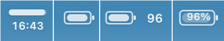
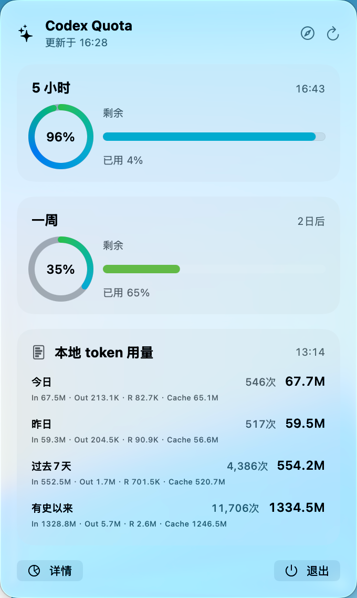
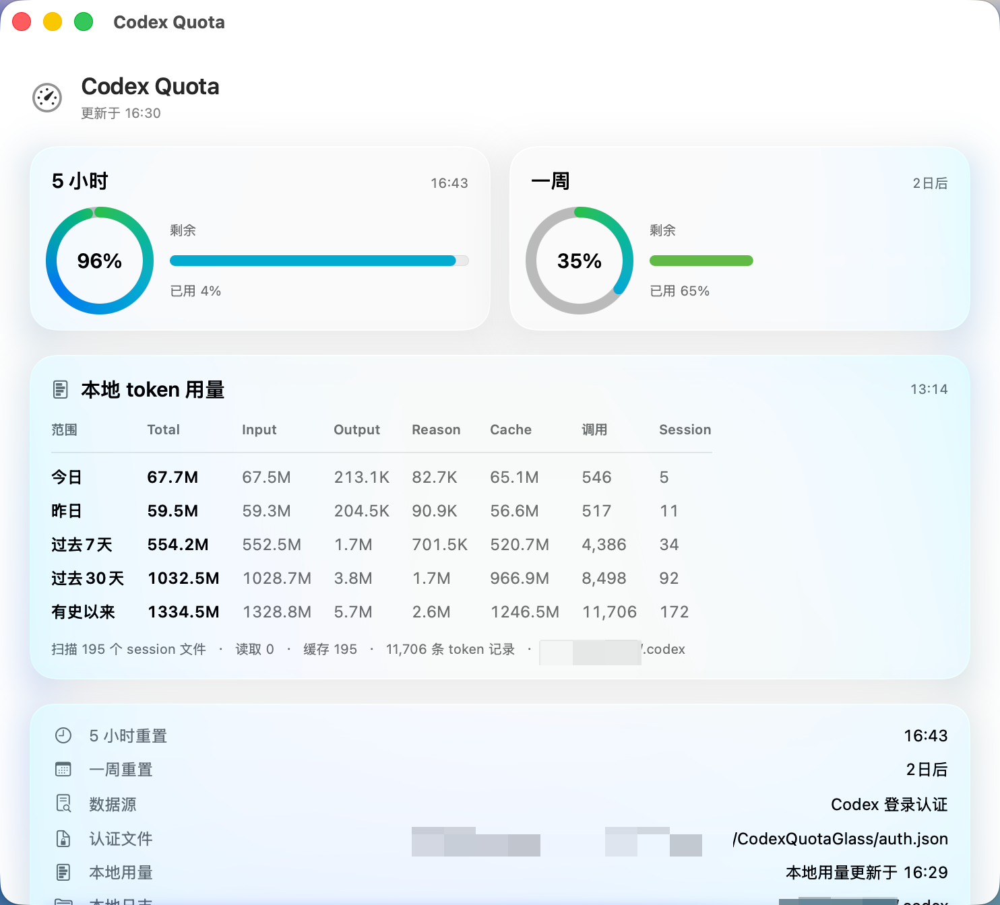
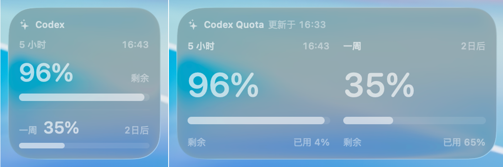
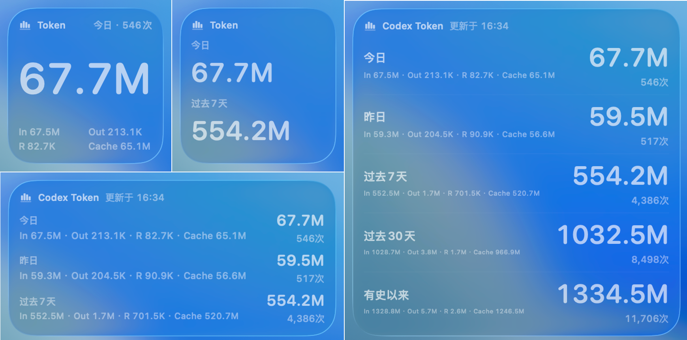

# CodexQuotaGlass

CodexQuotaGlass 是一个原生 macOS 菜单栏应用，用 Liquid Glass 风格展示 Codex 额度和本地 token 用量。它面向日常使用场景：不用打开终端，也能快速看到 5 小时额度、一周额度、重置时间，以及 Codex 本地 session 的 token 消耗统计。

## 功能

- 菜单栏紧凑显示 Codex 5 小时剩余额度，可选择进度条或类似 macOS 电量的图标样式。
- 菜单栏弹窗展示 5 小时额度、一周额度、本地 token 用量和快捷操作。
- 桌面小组件支持展示 quota 或 token 用量，并可按小型、中型、大型配置展示时间段。
- 详情页展示完整额度、认证状态、本地日志统计、更新状态和菜单栏设置。
- 支持浏览器登录，也支持从本机 Codex 配置中快捷导入认证。
- 解析 `~/.codex` 下的本地日志与 session 记录，统计今日、昨日、过去 7 天、过去 30 天和有史以来的 input/output/reasoning/cache token 用量与调用次数。

## 截图与显示位置

CodexQuotaGlass 主要显示在三个地方：

- macOS 菜单栏
- 菜单栏弹出的 Liquid Glass 详情面板
- macOS 桌面小组件

### macOS菜单栏
提供四种不同样式的菜单栏组件可选，可直观显示5小时剩余额度。


### 菜单栏弹出菜单

点击菜单栏图标后的菜单，展示剩余额度信息和本地用量信息。可选择用量信息中想要展示的时间段。



点击“详情”后可展开详细信息和设置面板。



### 桌面小组件

以桌面小组件的形式展示剩余额度和本地用量信息。支持大中小三种形状，五种用量统计口径。

展示剩余额度：



展示本地用量信息，支持自定义展示时间段：



## 认证与隐私

应用会把自己的认证文件保存在：

```text
~/Library/Application Support/CodexQuotaGlass/auth.json
```

支持两种登录方式：

- `网页登录`：通过浏览器完成 Codex/OpenAI 登录并写入应用自己的认证文件。
- `从 Codex 快捷登录`：从本机 `~/.codex/auth.json` 导入一次认证信息到应用目录。

桌面小组件不会读取认证 token。小组件只读取主应用写入 App Group 的 quota/token 缓存。

## 本地 token 统计

应用会读取默认 `~/.codex` 目录下的本地日志和 session 记录，统计：

- input tokens
- output tokens
- reasoning output tokens
- cached input tokens
- total tokens
- 调用次数
- session 数量

统计时间段包括今日、昨日、过去 7 天、过去 30 天和有史以来。

## 安装与构建

发布版推荐从 GitHub Releases 下载 DMG：

```text
https://github.com/LuckySJTU/CodexQuotaGlass/releases/latest
```

本地开发、签名、小组件注册、DMG 打包和排障说明见：

```text
DEV.md
```

## 系统要求

- macOS 14 或更新版本。
- 桌面小组件需要使用 Xcode 签名后的 app bundle。
- 本地构建需要 Swift 6 toolchain 和 Xcode。

## 版本

当前发布版本：`v1.1.0`
